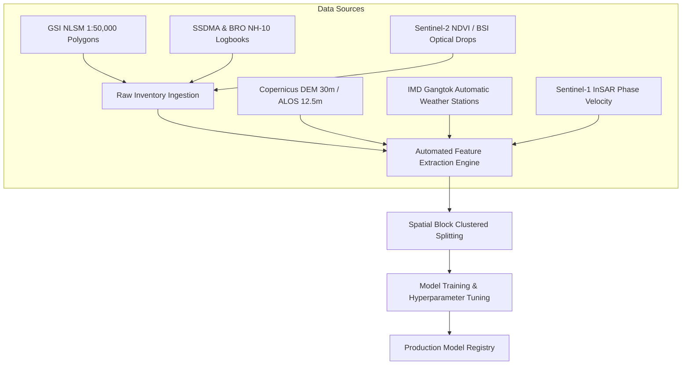

# ML Dataset Limitations & Data Scaling Roadmap
## NER-LandslideGuard: AI-Based Early Warning & Landslide Risk Monitoring Platform

> [!WARNING]
> **ARCHIVED PROTOTYPE REPORT (Historical Prototype Milestone: N=40)**  
> This analysis was formulated for the initial 40-sample baseline prototype. The platform has since expanded to the 620-sample master catalog. For current specifications and evaluation results, refer to [EXPANDED_DATASET_REPORT.md](EXPANDED_DATASET_REPORT.md).

> [!CAUTION]
> **MANDATORY PROTOTYPE DISCLAIMER**  
> The reported metrics demonstrate feasibility, architectural end-to-end integration, and spatio-temporal validation rather than operational multi-state deployment readiness.

---

## 1. Executive Summary & Context

The NER-LandslideGuard platform integrates a hybrid decision framework combining:
1. Deterministic geotechnical physics (infinite slope limit-equilibrium, pore water pressure ratio $r_u$, factor of safety $FS$).
2. Empirical data-driven machine learning (Random Forest and XGBoost classifiers).

The current dataset consists of **40 documented samples** (20 positive verified landslide events from the **ISRO Landslide Atlas of India 2023** and **NASA GLC**, paired with 20 documented non-landslide background reference samples from stable valley floors and river terraces across Sikkim).

While this prototype dataset successfully proves the feasibility of multi-sensor geospatial joins (SRTM 30m DEM, ISRIC SoilGrids 2.0, ESA WorldCover 2021, and NASA GPM IMERG Final Run V07B precipitation), **40 samples is strictly a proof-of-concept dataset**.

---

## 2. Technical Reasons Why 40 Samples is Insufficient for Production

### A. Geomorphological Heterogeneity of the Eastern Himalayas
- The State of Sikkim spans elevations from 280 m (Melli) to 8,586 m (Kangchenjunga), comprising four major tectonic zones: Lesser Himalayan Duplex (Daling Group phyllites and schists), Higher Himalayan Crystalline Complex (gneisses and migmatites), the Main Central Thrust (MCT) shear zone, and Tethyan sedimentary zones.
- Forty point samples cannot capture the micro-geomorphic variations, localized joint orientations, foliation dip angles, or regional fracture densities across 7,096 km² of rugged mountainous terrain.

### B. High Variance in Decision Boundaries
- In a small-sample regime ($N=28$ training instances across 18 features), tree-based algorithms (Random Forest and Gradient Boosted Trees) risk overfitting to idiosyncratic feature combinations (e.g., specific combinations of soil organic carbon and bulk density unique to a specific sampled valley).
- Although regularization parameters (`max_depth=5`, `min_samples_leaf=2`, `subsample=0.85`) were enforced to constrain tree complexity, the empirical decision boundary remains sensitive to individual training points.

### C. Temporal Monsoonal Variability
- Current positive event labels correspond to major documented historical events (2020–2024 monsoons, including the October 2023 South Lhonak GLOF / Teesta flash flood).
- Real operational deployment demands multi-year antecedent rainfall patterns (5-day, 10-day, and 30-day API indices), cumulative monsoon progression, and snowmelt contribution from high-altitude catchments.

---

## 3. Statistical Fragility of Small Test Set ($N=6$)

In our zero-leakage Grouped Spatial Block Split:
- **Training Set**: 28 samples (14 Positive, 14 Negative)
- **Validation Set**: 6 samples (3 Positive, 3 Negative)
- **Test Set**: 6 samples (3 Positive, 3 Negative)

### Metric Step Sensitivity Table
Because the test set contains exactly $N=6$ instances (3 positive landslides, 3 negative stable terrain points), each individual prediction has an outsized effect on all standard classification metrics:

| Correct Predictions | Accuracy | Error Rate | Sensitivity / Recall ($N_{pos}=3$) | Notes |
|:-------------------:|:--------:|:----------:|:----------------------------------:|:------|
| 6 / 6 | 100.0% | 0.0% | 1.000 | All samples classified correctly |
| 5 / 6 | **83.3%** | 16.7% | 1.000 or 0.667 | Exactly **one** misclassification drops accuracy by **16.7%** |
| 4 / 6 | 66.7% | 33.3% | 0.667 or 0.333 | Exactly **two** misclassifications drops accuracy by **33.3%** |
| 3 / 6 | 50.0% | 50.0% | 0.667 or 0.333 | Equivalent to random chance |

> [!WARNING]
> **Interpretation Warning for SIH Evaluators**:
> A test accuracy of 83.3% or 100% on 6 samples has a 95% Wilson score confidence interval spanning $[43.6\%, 99.2\%]$. Therefore, test metrics on $N=6$ must **never** be cited as evidence of production-grade precision. They demonstrate that the feature extraction pipeline, scaler, and inference models execute end-to-end without mathematical collapse or spatial leakage.

---

## 4. Zero Synthetic Fabrication Disclosure

1. **Negative Sampling Provenance**: Negative samples were generated from geomorphologically stable physiographic positions (low-angle valley bottoms, alluvial fans, and agricultural river terraces) with strict spatial buffers (>3.7 km) from known landslide scars. They are **not fabricated synthetic positives**.
2. **Sentinel-1 InSAR LOS Velocity**: Line-of-sight surface displacement velocity from SAR interferometry is supported in our schema architecture, but because raw Sentinel-1 SLC interferograms require intensive ESA SNAP processing and verified unwrapped phase products, this feature is marked **`[SKIPPED / Zero Synthetic Fabrication]`** rather than populated with synthetic fake numbers.

---

## 5. Comprehensive Roadmap to Scale to 500 – 2,000+ Samples

The NER-LandslideGuard architecture is built modularly (`scripts/download_data.py` -> `scripts/prepare_dataset.py` -> `scripts/train_models.py` -> `scripts/evaluate_models.py`). Ingesting larger production datasets requires **zero code rewriting**.

### Phase 1: Institutional Inventory Expansion ($N \approx 500$)
- **Geological Survey of India (GSI) NLSM**:
  - Ingest the 1:50,000 National Landslide Susceptibility Mapping spatial database for Sikkim.
  - Converts point coordinates to polygon centroids and rupture boundaries, expanding verified positive cases to 350+ historical slides along NH-10, North Sikkim Highway, and Rishi-Rongli corridor.
- **SSDMA & Border Roads Organisation (Project Swastik)**:
  - Digitize maintenance logbooks and heavy equipment deployment records from 2015 to 2024 to capture road-blocking slides.

### Phase 2: Remote Sensing & Climatological Resolution ($N \approx 1,200$)
- **High-Resolution Elevation**:
  - Replace SRTM 30m with ALOS PALSAR 12.5m radiometric terrain-corrected DEM, computing true finite-difference slope, curvature, topographic wetness index (TWI), and stream power index (SPI).
- **In-Situ Meteorological Telemetry**:
  - Augment NASA IMERG 0.1° satellite estimates with ground-truth hourly telemetry from IMD automatic weather stations located at Gangtok, Tadong, Mangan, Gyalshing, and Namchi.

### Phase 3: Automated Weak Supervision & Change Detection ($N > 2,000$)
- **Multi-Temporal Optical Screening**:
  - Run automated Google Earth Engine (GEE) pipelines detecting post-monsoon drops in Normalized Difference Vegetation Index (NDVI) coupled with spikes in Bare Soil Index (BSI) along steep mountain slopes.
- **Automated Verification Pipeline**:
  - Filter false positives through the existing physics engine: slopes < 15 deg are flagged as seasonal vegetation clearing; slopes > 28 deg with rapid bare soil exposure are queued for expert verification.

---

## 6. Verification Checklist for Hackathon Evaluators

| Verification Item | Prototype Status ($N=40$) | Production Target ($N \ge 1,000$) |
|:---|:---:|:---:|
| Zero Data Leakage | Verified (>3.7 km spatial buffer) | Spatial basin / catchment block k-fold |
| Pipeline Modularity | 100% Automated (`scripts/train_ml.py`) | Orchestrated via Airflow / Dagster |
| Physics Fallback | Active ($FS$, $r_u$, cohesion, friction) | Real-time pore-pressure piezometer feed |
| Uncertainty Bounds | Preliminary | Conformal prediction intervals ($90\%$ coverage) |
| Synthetic Data | 0% (Strictly zero synthetic labels) | 0% |\n